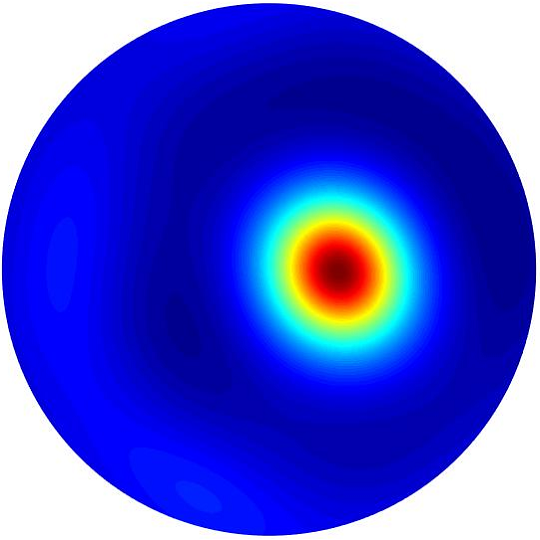

# eit_app: Electrical Impedance Tomography (EIT) application
# 

Thank you for the interest in `eit_app`!

`eit_app` is **a python-based, open-source framework for Electrical Impedance Tomography (EIT) reconstruction.**
Available https://github.com/DavidMetzIMT/eit_app

using a Sciospec EIT32-device from the compagny Sciospec

## 1. Introduction

### 1.1 Dependencies

| Packages        | Optional   | Note                                     | Links |
| --------------  | ---------- | ---------------------------------------- |-------|
| **numpy**       |            | tested with `numpy-1.21.2`               | |
| **dataclasses** |            | tested with `dataclasses-0.8`            | |
| **matplotlib**  |            | tested with `matplotlib-3.3.2`           | |
| **PyQt5**       |            | tested with `PyQt5-5.15.6`               | |
| **pyserial**    |            | tested with `pyserial-3.5`               | |
| **eit_model**   |            | tested with `eit_model` >> `pyEIT`, `eit_ai`            | [eit_model](https://github.com/DavidMetzIMT/eit_model), [pyEIT](https://github.com/liubenyuan/pyEIT), [eit_ai](https://github.com/DavidMetzIMT/eit_ai)|
| **eit_ai**      |            | tested with `eit_ai`  >> `keras`, `pytorch` |[eit_ai](https://github.com/DavidMetzIMT/eit_ai) |
| **glob_utils**  |            | tested with `glob_utils`               | [glob_utils](https://github.com/DavidMetzIMT/glob_utils)|

### 1.2 Features
 - [x] Serial communication with `Sciospec EIT32-device`
 - [x] Setting/reading measurements setups of the `Sciospec EIT32-device`
 - [x] Impedance Measurements aquisition (continious mode) with `Sciospec EIT32-device`
 - [x] Saving of measurements
 - [x] Replay of saved measurements
 - [x] Liveview plots of measurements values
 - [x] Liveview plots of 2D reconstruction using `pyEIT` reconstruction algorithms:Gauss-Newton solver (JAC), Back-projection (BP), 2D GREIT
 - [x] Liveview plots of 2D reconstruction using Neuronal Network
 - [ ] Liveview plots of 3D reconstruction 
 - [x] Liveview of chamber from usb camera and saving of image for measuremnets 
 - [ ] Complete electrode model (CEM) support (not in `pyEIT` implemented yet)
	
## 2. Installation

`eit_app` is purely python based, it can be installed and run without any difficulty. NOT TESTED YET!!!

### 2.1 Install global
### 2.2 Install 
## 3. Run the app

### 3.1 examples of apps

### 3.2 (3D) forward and inverse computing

## 4. Contribute to `eit_app`.

## 5. Cite our work.

**If you find `eit_app` useful, please cite our work!**

