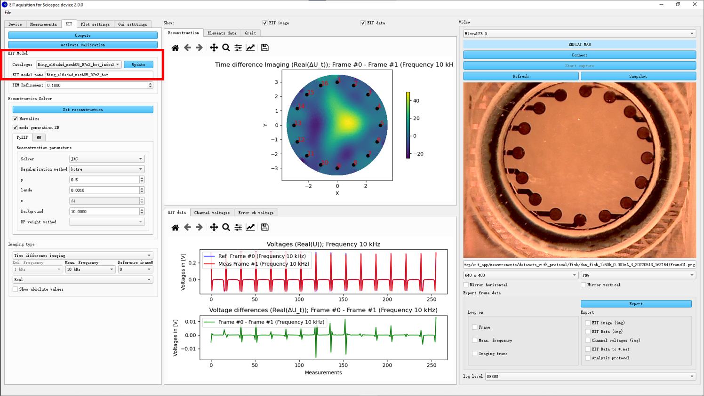

# eit_app: Electrical Impedance Tomography (EIT) application
Thank you for the interest in `eit_app`!

`eit_app` is **a python-based, open-source framework for Electrical Impedance Tomography (EIT) reconstruction.**
Available https://github.com/DavidMetzIMT/eit_app

## 1. Introduction
### 1.1 Dependencies
| Packages        | Optional   | Note                                     | Links |
| --------------  | ---------- | ---------------------------------------- |-------|
| **numpy**       |            | tested with `numpy-1.21.2`               | |
| **dataclasses** |            | tested with `dataclasses-0.8`            | |
| **matplotlib**  |            | tested with `matplotlib-3.3.2`           | |
| **PyQt5**       |            | tested with `PyQt5-5.15.6`               | |
| **pyserial**    |            | tested with `pyserial-3.5`               | |
| **eit_model**   |            | tested with `eit_model` >> `pyEIT`, `eit_ai`            | [eit_model](https://github.com/DavidMetzIMT/eit_model), [pyEIT](https://github.com/liubenyuan/pyEIT), [eit_ai](https://github.com/DavidMetzIMT/eit_ai)|
| **eit_ai**      |            | tested with `eit_ai`  >> `keras`, `pytorch` |[eit_ai](https://github.com/DavidMetzIMT/eit_ai) |
| **glob_utils**  |            | tested with `glob_utils`               | [glob_utils](https://github.com/DavidMetzIMT/glob_utils)|


### 1.2 Features
 - [x] Serial communication with `a Sciospec EIT32-device from the compagny Sciospec`
 - [x] Setting/reading measurements setups of the `Sciospec EIT32-device`
 - [x] Impedance Measurements aquisition (continious mode) with `Sciospec EIT32-device`
 - [x] Saving of measurements
 - [x] Replay of saved measurements
 - [x] Liveview plots of measurements values
 - [x] Liveview plots of 2D reconstruction using `pyEIT` reconstruction algorithms:Gauss-Newton solver (JAC), Back-projection (BP), 2D GREIT
 - [x] Liveview plots of 2D reconstruction using Neuronal Network
 - [ ] Liveview plots of 3D reconstruction 
 - [x] Liveview of chamber from usb camera and saving of image for measuremnets 
 - [ ] Complete electrode model (CEM) support (not in `pyEIT` implemented yet)
	
## 2. Installation
`eit_app` is purely python based, it can be installed and run without any difficulty.

## 3. Use the app

### 3.1 Run the app
```python
cd path/to/eit_app
python eit_app/main.py
```

When open the app at first time, some global directories will be asked.

The GUI has three columns. The left is measurement configurations. The middle column shows the image reconstruction and the voltage plots. The right column shows the camera figure and export configuration.

### 3.2 Choose EIT model
The first step is to choose the EIT model, by loading a mat-file. In this file the design of the chamber with the electrodes and the injection and measurement patterning are defined. Such file are “infos2py.mat”-file created by [`App_EIDORS_ModelSim`](https://github.com/DavidMetzIMT/App_EIDORS_ModelSim)). 

Thanks that file a model of the chamber can be defined with electrodes.

<br>
*Selection of EIT-Model*

Notes:
- TODO save/load the Eit_model as json for less matalb depedencies

### 3.3 Connect the device
Actually only EIT-32 Device from Sciospec can be used using USB FB. 
diffrent actions ar here possible:
- `Refresh`, search for EIT-32 Device from Sciospec on Serial ports
- ``Connect``, connect device selected
- ``Disconnect``, disconnect actual device
- ``Get Setup``, get the actual setups of the device (Injection pattern is maybe not correct!...)
- ``Set setup``, set the setup of the device using the passed settings
- ``Reset Setup``, reset the setup to factory/start-up settings
- ``Save/Load Setup``, save/load the setup to/from json-file

For setting the setup please look the documentation of the sciospec device.

The ``Chip Type`` defines the pairs the electrodes define the model and the channel of the device which ar connected together.
for example in the model presented below the electrode #1 define in the model is on the top. But on the snapshot the top electrode is connected to the channel #16. The Chip-type are defined by a txt-file containing those electrode/channel pairs:
```
1 16
2 15
3 14
4 13
5 12
6 11
...
```
You can add such a txt-file ind dir "chip_design" for adding new Type!

The “Excitation/injection Pattern” is displayed fro two point of views: which are related to this chip type:
- **Model view** shows the injection pattern with the #electrode commimg from the loaded **EIT model**
- and **Chip view** shows the corresponding injection pattern with the #channel as defined in the chip type.

<br>
*Selection of EIT-Model*

Notes:
- extend App for other devices
- **Attention**: by loading measurements the chip has to be reselected...! (TODO save it with measurmenents)

### 3.4 Data acquisition/ Measurements
After connecting and setting the device, measurmenets can be started/paused/resumed and stopped.

During the acquisition multiple actions are done:
- **Saving actions**:
    - create a measurement-dataset directory under "measurements/" using the dataset-name passed by the user (datetime is added to avoid overwriting odler dataset)
    - save the setup of the device
    - each measurement-frame the measurement data are saved in single json-file
    - If the camera has been connected and the capture started (before meas. start), a snapshot of each frame will be saved.
- **Computing/ploting actions**:
    - display the metadate of the last frame in "Frame infos":  Frequency, Amplitude, excitation etc
    - compute/plot electrode voltages
    - compute/plot eit data, which are used for the reconstruction, for the selected imaging configuration
    - compute/plot the eit image if a reconstruction solver has been initilizated. 
    - If the camera has been connected and the capture started, the snapshot is diplayed.

<br>
*Aquisition of measurements*

### 3.5 Measurement replay
The replay part allow to reload measurement dataset. This allow you to test/rerun other reconstruction/imaging settings, export data, ...

<br>
*Selection of imaging configurations*

By playing the replay or selecting another frame, same data will be computed/plot as during aquisition. 

Notes:
- **Attention**: When replay the measurement, if the camera state is still measuring, the image will be overwritten.

### 3.6 Reconstruction

#### 3.6.0 Generalities
For EIT image reconstruction two solvers are available (see [eit_model](https://github.com/DavidMetzIMT/eit_model)):
- ``pyeit`` based solver, see [pyEIT](https://github.com/liubenyuan/pyEIT), 
- AI based solver, see [eit_ai](https://github.com/DavidMetzIMT/eit_ai)
 
<br>
*Selection of imaging configurations*

“Activate calibration” allows to calibrate the  voltages.
The reconstruction image and Voltage plots will be computed every frame. 


Notes:
- **Attention**: When replay the measurement, if the camera state is still measuring, the image will be overwritten.

#### 3.6.1 ``Pyeit`` based solver

pyEIT reconstruction can run during the data acquisition. 

#### 3.6.2 AI based solver

This solver used a trained model corresponding to a specific, EIT-model(meshing). Such model can be trained using the package [eit_ai](https://github.com/DavidMetzIMT/eit_ai)

During AI reconstruction setting, the model path will be asked. Before loading the model, the EIT model should be selected correctly for that load the "*infos2py.mat" file from the training dataset. 

#### 3.6.3 Imaging
EIT data used for the reconstruction are generated using an “Imaging” configuration:
- type : abasolute, time -, frequency difference
- part of the impedance: real, image, magnitude, phase
- ref, meas. frequency, ref. frame.

#### 3.6.4 2D Reconstruction

Set FEMrefinement before setting the reconstruction.
Both pyEIT and Ai solver can be selected for EIT reconstruction. Any solver should select correspondant EIT model. pyEIT reconstruction can run during the data acquisition. 

#### 3.6.5 3D Reconstruction
For showing the 3D view, “mode generation 2D” should be unclicked. Click “Open pyvista viewer” in **Plot settings** first, then adjust the parameters of pyEIT and set the solver. 

<br>
*Aditional 3D visualisation*

### 3.7 Export frame data

In Replay mode (after loading a meas. dataset) it is possible to extract multiple data:

- ``EIT image``, export the reconstruction image 
- ``EIT data``, export the reconstruction data
- ``Analysis protocol``, export the metadata about the dataset including measurement settings, EIT model, parameters of reconstruction solver
- ...

Those data can be exported automatically loopwise for all frames, all meas. frequencies and all imaging types

<br>
*Selection of export configurations*


## 4. Contribute to `eit_app`.


## 5. Cite our work.


**If you find `eit_app` useful, please cite our work!**


